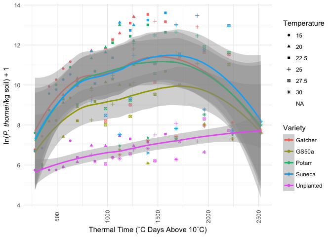
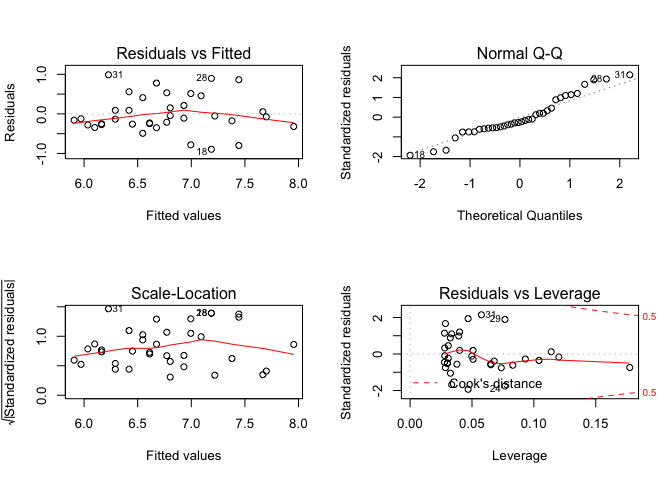
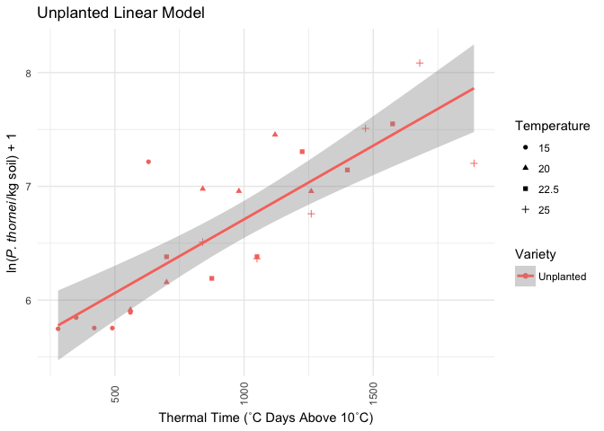
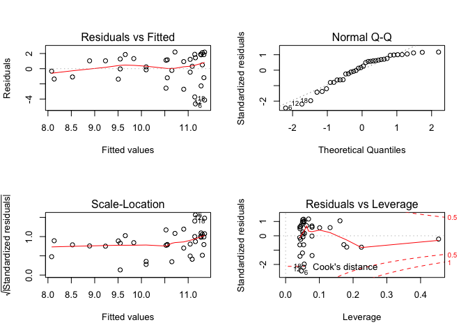
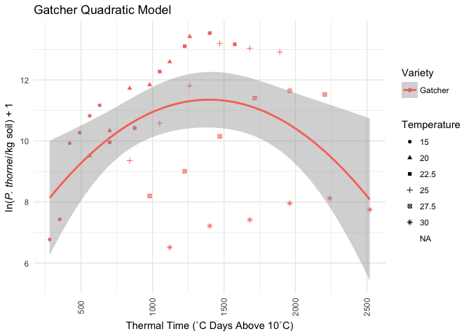
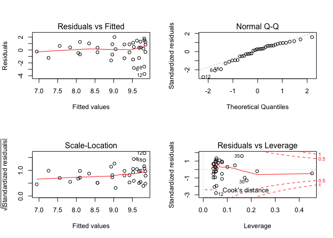
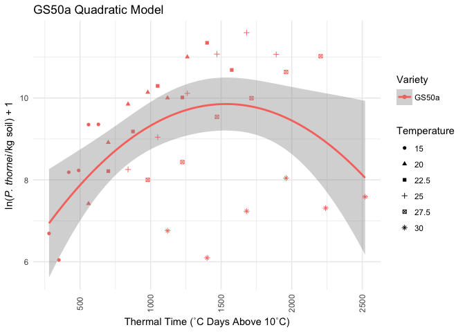

Fitting Linear and Quadratic Models of Nematode Population Responses to
Time and Temperature
================

AH Sparks<sup>1</sup> and JP Thompson<sup>1</sup>

  - <sup>1</sup> University of Southern Queensland, Centre for Crop
    Health, West St., Toowoomba, Queensland, Australia

> Thompson, JP, 2015. Modelling population densities of root-lesion
> nematode *Pratylenchus thornei* from soil profile temperatures to
> choose an optimum sowing date for wheat in a subtropical region.
> *Field Crops Research* 183:50-55 DOI: 10.1016/j.fcr.2015.07.005. URL:
> <http://www.sciencedirect.com/science/article/pii/S0378429015300083>

# Introduction

*Pratylenchus thornei*, the root-lesion nematode is widely distributed
in wheat (*Triticum aestivum*) growing areas of many countries and is of
particular concern in sub-tropical environments (Thompson 2015). These
nematodes penetrate roots to feed and reproduce in the root cortex
leading to loss of root function, which affects nutrient and water
uptake of nutrients and water causing nutrient deficiency and water
stress (Thompson 2015).

In the original paper the population of *P. thornei* in wheat in
Queensland, Australia is modelled using a linear and quadratic
equations. The study aimed to investigate the effects of soil profile
temperatures after different sowing dates on reproduction of the
nematodes in susceptible and moderately resistant wheat cultivars in the
subtropical grain region of eastern Australia. Thi s document recreates
the models for population densities of *P. thornei* as described in
*Modelling population densities of root-lesion nematode (*P. thornei*)
from soil profile temperatures to choose an optimum sowing date for
wheat* (Thompson 2015).

There are two types of models described in the paper, the first model is
a linear model used to describe the unplanted control and two quadratic
models fit Gatcher (Susceptible) and GS50a (Moderately Resistant) wheat
cultivars.

## Session Setup

Using the *tidyverse* package simplifies the libraries. It loads,
*readr*, used to import the data, *tidyr* used to format the data and
*ggplot2* used for visualising the data.

``` r
library(tidyverse)
```

We will use the `set.seed` function for reproducibility.

    set.seed(52)

## Data Import and Inspection

Import the data using `read.csv` from *readr*, which is a part of the
*tidyverse*.

``` r
nema <- read_csv("data/Degree Days Relationships.csv")

nema
```

    ## # A tibble: 36 x 9
    ##    Weeks  Days Temperature Degree_days Unplanted Gatcher GS50a Potam
    ##    <int> <int>       <dbl>       <int>     <dbl>   <dbl> <dbl> <dbl>
    ##  1     8    56        15.0         280      5.75    6.77  6.69  7.61
    ##  2     8    56        20.0         560      5.92    9.51  7.42  9.28
    ##  3     8    56        22.5         700      6.38    9.96  8.21  9.02
    ##  4     8    56        25.0         840      6.51    9.35  8.25  9.73
    ##  5     8    56        27.5         980      6.06    8.20  8.00  8.82
    ##  6     8    56        30.0        1120      6.33    6.52  6.76  6.96
    ##  7    10    70        15.0         350      5.85    7.44  6.04  5.97
    ##  8    10    70        20.0         700      6.16   10.3   8.91 10.3 
    ##  9    10    70        22.5         875      6.19   10.4   9.18 10.7 
    ## 10    10    70        25.0        1050      6.36   10.6   9.04 10.5 
    ## # ... with 26 more rows, and 1 more variable: Suneca <dbl>

You can see that each of the varieties have their own column in the
original data format (wide). Using `gather()` from the *tidyr* package
(part of the *tidyverse*), convert from to long format where the
varieties are all listed in a single column, “Variety”. The `data`
paramter tells R which data frame to gather. The `key` parameter is the
name of the new column to be created called “Variety”, `value` specifies
the column that will contain the values that go with the varieties,
“Population”. The last portion tells `gather()` which columns are to
be gathered. Using the “:” means take the columns from “Unplanted” to
“Suneca” and gather them without needing to type all the column names.

``` r
nema_long <-
  gather(data = nema,
         key = Variety,
         value = Population,
         Unplanted:Suneca)

nema_long
```

    ## # A tibble: 180 x 6
    ##    Weeks  Days Temperature Degree_days Variety   Population
    ##    <int> <int>       <dbl>       <int> <chr>          <dbl>
    ##  1     8    56        15.0         280 Unplanted       5.75
    ##  2     8    56        20.0         560 Unplanted       5.92
    ##  3     8    56        22.5         700 Unplanted       6.38
    ##  4     8    56        25.0         840 Unplanted       6.51
    ##  5     8    56        27.5         980 Unplanted       6.06
    ##  6     8    56        30.0        1120 Unplanted       6.33
    ##  7    10    70        15.0         350 Unplanted       5.85
    ##  8    10    70        20.0         700 Unplanted       6.16
    ##  9    10    70        22.5         875 Unplanted       6.19
    ## 10    10    70        25.0        1050 Unplanted       6.36
    ## # ... with 170 more rows

Now that the data are in the format that *ggplot2* prefers, take a look
at the data first to see what it looks like. Fit a smoothed line for
each Variety to the raw data. The individual temperatures are shown here
by shape, the variety by colour.

``` r
ggplot(
  nema_long,
  aes(
    x = Degree_days,
    y = Population,
    colour = Variety,
    group = Variety
  )
) +
  geom_point(aes(shape = as.factor(Temperature))) +
  geom_smooth() +
  ylab(expression(paste("ln(",
                        italic("P. thornei"),
                        "/kg soil) + 1"),
                  sep = "")) +
  xlab("Thermal Time (˚C Days Above 10˚C)") +
  theme_minimal() +
  scale_shape_discrete("Temperature") +
  theme(axis.text.x  = element_text(angle = 90,
                                    vjust = 0.5))
```

    ## `geom_smooth()` using method = 'loess' and formula 'y ~ x'

<!-- -->

# Model Fitting

## Unplanted Model

The paper uses a linear model for the unplanted control. Here write a
function to use in modelling the unplanted population data.

### Linear Model

``` r
linear_model <- function(df) {
  lm(Population ~ Degree_days,
     data = df)
}
```

Now check the model fit, using `filter()` from *dplyr* to select only
Unplanted data from the data set for the model and fit the linear model
to the data.

Lastly we can show the unplanted data alone as a scatterplot with the
model line fitted using `geom_smooth()` from *ggplot2*.

``` r
unplanted_model <- nema_long %>%
  filter(Variety == "Unplanted") %>%
  linear_model()

par(mfrow = c(2, 2))
plot(unplanted_model)
```

<!-- -->

``` r
summary(unplanted_model)
```

    ## 
    ## Call:
    ## lm(formula = Population ~ Degree_days, data = df)
    ## 
    ## Residuals:
    ##     Min      1Q  Median      3Q     Max 
    ## -0.8955 -0.2629 -0.1162  0.2622  0.9889 
    ## 
    ## Coefficients:
    ##              Estimate Std. Error t value Pr(>|t|)    
    ## (Intercept) 5.6508299  0.1878225  30.086  < 2e-16 ***
    ## Degree_days 0.0009147  0.0001404   6.514 1.87e-07 ***
    ## ---
    ## Signif. codes:  0 '***' 0.001 '**' 0.01 '*' 0.05 '.' 0.1 ' ' 1
    ## 
    ## Residual standard error: 0.4742 on 34 degrees of freedom
    ## Multiple R-squared:  0.5551, Adjusted R-squared:  0.542 
    ## F-statistic: 42.43 on 1 and 34 DF,  p-value: 1.869e-07

``` r
nema_long %>%
  group_by(Variety) %>%
  filter(Variety == "Unplanted") %>%
  ggplot(aes(
    x = Degree_days,
    y = Population,
    colour = Variety,
    group = Variety
  )) +
  geom_point(aes(shape = as.factor(Temperature))) +
  geom_smooth(method = "lm",
              formula = y ~ x,
              size = 1) +
  ylab(expression(paste("ln(",
                        italic("P. thornei"),
                        "/kg soil) + 1"),
                  sep = "")) +
  xlab("Thermal Time (˚C Days Above 10˚C)") +
  theme_minimal() +
  scale_shape_discrete("Temperature") +
  scale_colour_discrete("Variety") +
  theme(axis.text.x  = element_text(angle = 90,
                                    vjust = 0.5)) +
  ggtitle("Unplanted Linear Model")
```

<!-- -->

## Quadratic Models

In the original paper, Gatcher and GS50a best fit quadratic models,
which are fit here.

``` r
quadratic_model <- function(df) {
  lm(Population ~ Degree_days + I(Degree_days^2),
      data = df)
}
```

### Susceptible Varieties

Gatcher, Potam and Suneca all have very similar curves, here Gatcher is
used to fit a quadratic model as in the original paper following the
same methods as above for the linear model.

``` r
s_model <- nema_long %>%
  filter(Variety == "Gatcher") %>% 
  quadratic_model()

par(mfrow = c(2, 2))
plot(s_model)
```

<!-- -->

``` r
summary(s_model)
```

    ## 
    ## Call:
    ## lm(formula = Population ~ Degree_days + I(Degree_days^2), data = df)
    ## 
    ## Residuals:
    ##     Min      1Q  Median      3Q     Max 
    ## -4.6400 -1.1890  0.4089  1.3579  2.1952 
    ## 
    ## Coefficients:
    ##                    Estimate Std. Error t value Pr(>|t|)    
    ## (Intercept)       6.315e+00  1.484e+00   4.256 0.000162 ***
    ## Degree_days       7.218e-03  2.450e-03   2.947 0.005854 ** 
    ## I(Degree_days^2) -2.587e-06  9.056e-07  -2.856 0.007357 ** 
    ## ---
    ## Signif. codes:  0 '***' 0.001 '**' 0.01 '*' 0.05 '.' 0.1 ' ' 1
    ## 
    ## Residual standard error: 1.94 on 33 degrees of freedom
    ## Multiple R-squared:  0.2083, Adjusted R-squared:  0.1604 
    ## F-statistic: 4.342 on 2 and 33 DF,  p-value: 0.02118

``` r
nema_long %>%
  group_by(Variety) %>%
  filter(Variety == "Gatcher") %>%
  ggplot(aes(
    x = Degree_days,
    y = Population,
    colour = Variety,
    group = Variety
  )) +
  geom_point(aes(shape = as.factor(Temperature))) +
  geom_smooth(method = "lm",
              formula = y ~ x + I(x^2),
              size = 1) +
  ylab(expression(paste("ln(",
                        italic("P. thornei"),
                        "/kg soil) + 1"),
                  sep = "")) +
  xlab("Thermal Time (˚C Days Above 10˚C)") +
  theme_minimal() +
  scale_shape_discrete("Temperature") +
  scale_colour_discrete("Variety") +
  theme(axis.text.x  = element_text(angle = 90,
                                    vjust = 0.5)) +
  ggtitle("Gatcher Quadratic Model")
```

<!-- -->

### Moderately Resistant Cultiver

GS50a, moderately resistant to *P. thornei* also fit a quadratic model
but the coefficients were slightly different due to different responses
to the variety and temperature.

``` r
mr_model <- nema_long %>%
  filter(Variety == "GS50a") %>%
  quadratic_model()

par(mfrow = c(2, 2))
plot(mr_model)
```

<!-- -->

``` r
summary(mr_model)
```

    ## 
    ## Call:
    ## lm(formula = Population ~ Degree_days + I(Degree_days^2), data = df)
    ## 
    ## Residuals:
    ##     Min      1Q  Median      3Q     Max 
    ## -3.7265 -0.6842  0.3433  0.9217  2.0028 
    ## 
    ## Coefficients:
    ##                    Estimate Std. Error t value Pr(>|t|)    
    ## (Intercept)       5.492e+00  1.050e+00   5.231 9.33e-06 ***
    ## Degree_days       5.689e-03  1.733e-03   3.282  0.00244 ** 
    ## I(Degree_days^2) -1.854e-06  6.407e-07  -2.894  0.00669 ** 
    ## ---
    ## Signif. codes:  0 '***' 0.001 '**' 0.01 '*' 0.05 '.' 0.1 ' ' 1
    ## 
    ## Residual standard error: 1.373 on 33 degrees of freedom
    ## Multiple R-squared:  0.2726, Adjusted R-squared:  0.2285 
    ## F-statistic: 6.184 on 2 and 33 DF,  p-value: 0.005238

``` r
nema_long %>%
  group_by(Variety) %>%
  filter(Variety == "GS50a") %>%
  ggplot(aes(
    x = Degree_days,
    y = Population,
    colour = Variety,
    group = Variety
  )) +
  geom_point(aes(shape = as.factor(Temperature))) +
  geom_smooth(method = "lm",
              formula = y ~ x + I(x^2),
              size = 1) +
  ylab(expression(paste("ln(",
                        italic("P. thornei"),
                        "/kg soil) + 1"),
                  sep = "")) +
  xlab("Thermal Time (˚C Days Above 10˚C)") +
  theme_minimal() +
  scale_shape_discrete("Temperature") +
  scale_colour_discrete("Variety") +
  theme(axis.text.x  = element_text(angle = 90,
                                    vjust = 0.5)) +
  ggtitle("GS50a Quadratic Model")
```

<!-- -->

As in the original paper, the model equations can be derived from these
models as
    well.

# Reproducibility

    ## Session info -------------------------------------------------------------

    ##  setting  value                       
    ##  version  R version 3.4.3 (2017-11-30)
    ##  system   x86_64, darwin17.3.0        
    ##  ui       unknown                     
    ##  language (EN)                        
    ##  collate  en_AU.UTF-8                 
    ##  tz       Australia/Brisbane          
    ##  date     2018-01-30

    ## Packages -----------------------------------------------------------------

    ##  package    * version    date       source                          
    ##  assertthat   0.2.0      2017-04-11 CRAN (R 3.4.2)                  
    ##  backports    1.1.2      2017-12-13 cran (@1.1.2)                   
    ##  base       * 3.4.3      2018-01-23 local                           
    ##  bindr        0.1        2016-11-13 CRAN (R 3.4.2)                  
    ##  bindrcpp   * 0.2        2017-06-17 CRAN (R 3.4.2)                  
    ##  broom        0.4.3      2017-11-20 cran (@0.4.3)                   
    ##  cellranger   1.1.0      2016-07-27 CRAN (R 3.4.2)                  
    ##  cli          1.0.0      2017-11-10 Github (r-lib/cli@ab1c3aa)      
    ##  colorspace   1.3-2      2016-12-14 CRAN (R 3.4.2)                  
    ##  compiler     3.4.3      2018-01-23 local                           
    ##  crayon       1.3.4      2017-09-16 cran (@1.3.4)                   
    ##  datasets   * 3.4.3      2018-01-23 local                           
    ##  devtools     1.13.4     2017-11-09 CRAN (R 3.4.3)                  
    ##  digest       0.6.15     2018-01-28 cran (@0.6.15)                  
    ##  dplyr      * 0.7.4      2017-09-28 CRAN (R 3.4.2)                  
    ##  evaluate     0.10.1     2017-06-24 cran (@0.10.1)                  
    ##  forcats    * 0.2.0      2017-01-23 CRAN (R 3.4.2)                  
    ##  foreign      0.8-69     2017-06-22 CRAN (R 3.4.3)                  
    ##  ggplot2    * 2.2.1.9000 2018-01-22 Github (hadley/ggplot2@401511e) 
    ##  glue         1.2.0      2017-10-29 cran (@1.2.0)                   
    ##  graphics   * 3.4.3      2018-01-23 local                           
    ##  grDevices  * 3.4.3      2018-01-23 local                           
    ##  grid         3.4.3      2018-01-23 local                           
    ##  gtable       0.2.0      2016-02-26 CRAN (R 3.4.2)                  
    ##  haven        1.1.1      2018-01-18 cran (@1.1.1)                   
    ##  hms          0.4.1      2018-01-24 cran (@0.4.1)                   
    ##  htmltools    0.3.6      2017-04-28 cran (@0.3.6)                   
    ##  httr         1.3.1      2017-08-20 CRAN (R 3.4.2)                  
    ##  jsonlite     1.5        2017-06-01 CRAN (R 3.4.2)                  
    ##  knitr        1.19       2018-01-29 cran (@1.19)                    
    ##  labeling     0.3        2014-08-23 CRAN (R 3.4.2)                  
    ##  lattice      0.20-35    2017-03-25 CRAN (R 3.4.3)                  
    ##  lazyeval     0.2.1      2017-10-29 cran (@0.2.1)                   
    ##  lubridate    1.7.1      2017-11-03 cran (@1.7.1)                   
    ##  magrittr     1.5        2014-11-22 CRAN (R 3.4.2)                  
    ##  memoise      1.1.0      2017-04-21 CRAN (R 3.4.2)                  
    ##  methods    * 3.4.3      2018-01-23 local                           
    ##  mnormt       1.5-5      2016-10-15 CRAN (R 3.4.2)                  
    ##  modelr       0.1.1      2017-07-24 CRAN (R 3.4.2)                  
    ##  munsell      0.4.3      2016-02-13 CRAN (R 3.4.2)                  
    ##  nlme         3.1-131    2017-02-06 CRAN (R 3.4.3)                  
    ##  parallel     3.4.3      2018-01-23 local                           
    ##  pillar       1.1.0      2018-01-14 cran (@1.1.0)                   
    ##  pkgconfig    2.0.1      2017-03-21 CRAN (R 3.4.2)                  
    ##  plyr         1.8.4      2016-06-08 CRAN (R 3.4.2)                  
    ##  psych        1.7.8      2017-09-09 CRAN (R 3.4.2)                  
    ##  purrr      * 0.2.4      2017-10-18 cran (@0.2.4)                   
    ##  R6           2.2.2      2017-06-17 CRAN (R 3.4.2)                  
    ##  Rcpp         0.12.15    2018-01-20 cran (@0.12.15)                 
    ##  readr      * 1.1.1      2017-05-16 CRAN (R 3.4.2)                  
    ##  readxl       1.0.0      2017-04-18 CRAN (R 3.4.2)                  
    ##  reshape2     1.4.3      2017-12-11 cran (@1.4.3)                   
    ##  rlang        0.1.6.9003 2018-01-29 Github (tidyverse/rlang@a8c15c6)
    ##  rmarkdown    1.8        2017-11-17 CRAN (R 3.4.3)                  
    ##  rprojroot    1.3-2      2018-01-03 cran (@1.3-2)                   
    ##  rstudioapi   0.7        2017-09-07 CRAN (R 3.4.2)                  
    ##  rvest        0.3.2      2016-06-17 CRAN (R 3.4.2)                  
    ##  scales       0.5.0.9000 2018-01-15 Github (hadley/scales@d767915)  
    ##  stats      * 3.4.3      2018-01-23 local                           
    ##  stringi      1.1.6      2017-11-17 cran (@1.1.6)                   
    ##  stringr    * 1.2.0      2017-02-18 CRAN (R 3.4.2)                  
    ##  tibble     * 1.4.2      2018-01-22 cran (@1.4.2)                   
    ##  tidyr      * 0.7.2      2017-10-16 cran (@0.7.2)                   
    ##  tidyselect   0.2.3      2017-11-06 cran (@0.2.3)                   
    ##  tidyverse  * 1.2.1      2017-11-14 CRAN (R 3.4.3)                  
    ##  tools        3.4.3      2018-01-23 local                           
    ##  utf8         1.1.3      2018-01-03 cran (@1.1.3)                   
    ##  utils      * 3.4.3      2018-01-23 local                           
    ##  withr        2.1.1.9000 2018-01-15 Github (jimhester/withr@df18523)
    ##  xml2         1.2.0      2018-01-24 cran (@1.2.0)                   
    ##  yaml         2.1.16     2017-12-12 cran (@2.1.16)
